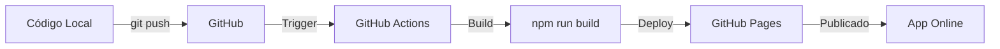

# 🚀 Deploy para Produção - GitHub Pages

## Passo a Passo

### 1. **Preparar Repositório Git**

Se ainda não inicializou:
```bash
git init
git add .
git commit -m "Initial commit - Cronoanalise app"
```

### 2. **Criar Repositório no GitHub**

1. Acesse https://github.com/new
2. Nome do repositório: `cronoanalise` (ou o que preferir)
3. **NÃO** marque "Initialize with README"
4. Clique em **Create repository**

### 3. **Conectar Local ao GitHub**

```bash
git remote add origin https://github.com/SEU-USUARIO/cronoanalise.git
git branch -M main
git push -u origin main
```

> ⚠️ **Importante**: Substitua `SEU-USUARIO` pelo seu username do GitHub

---

### 4. **Adicionar Secrets do Supabase**

Para que o app funcione em produção, você precisa configurar as variáveis de ambiente:

#### No GitHub:
1. Vá no seu repositório
2. **Settings** → **Secrets and variables** → **Actions**
3. Clique em **New repository secret**
4. Adicione cada uma:

| Name | Value |
|------|-------|
| `VITE_SUPABASE_URL` | Sua URL do Supabase |
| `VITE_SUPABASE_ANON_KEY` | Sua anon key do Supabase |

---

### 5. **Habilitar GitHub Pages**

1. No repositório, vá em **Settings**
2. Menu lateral: **Pages**
3. Em **Source**, selecione: **GitHub Actions**
4. Salve

---

### 6. **Deploy Automático**

O workflow já está configurado! Sempre que você fizer push para `main`:

```bash
git add .
git commit -m "Update app"
git push
```

O GitHub automaticamente:
1. ✅ Instala dependências
2. ✅ Injeta variáveis do Supabase
3. ✅ Faz build do projeto
4. ✅ Publica no GitHub Pages

---

### 7. **Acessar a Aplicação**

Após o deploy (leva ~2 minutos), seu app estará em:

```
https://SEU-USUARIO.github.io/crono/
```

---

## ⚙️ Arquivos de Configuração

### `.github/workflows/deploy.yml`
Já configurado! Auto-deploy no push para `main`.

### `vite.config.js`
Já tem `base: '/crono/'` para funcionar no GitHub Pages.

### `.env.local` (NÃO fazer commit!)
Este arquivo tem suas credenciais locais - **NUNCA** fazer commit dele!
O `.gitignore` já está protegendo.

---

## 🔧 Workflow Completo



---

## ✅ Checklist de Deploy

- [ ] Repositório criado no GitHub
- [ ] Código enviado (`git push`)
- [ ] Secrets configurados (Supabase URL e Key)
- [ ] GitHub Pages habilitado
- [ ] Workflow executou com sucesso
- [ ] App acessível online

---

## 🐛 Troubleshooting

### Build falha
- Verifique se os secrets estão configurados
- Veja os logs em **Actions** no GitHub

### App carrega mas não funciona
- Confirme que as variáveis Supabase estão corretas
- Teste o build local: `npm run build && npm run preview`

### URL errada
- Verifique o `base: '/crono/'` no `vite.config.js`
- Deve corresponder ao nome no workflow

---

## 📝 Atualizações Futuras

Para atualizar o app em produção:

```bash
# Faça suas alterações
git add .
git commit -m "Descrição das mudanças"
git push

# GitHub Actions faz deploy automaticamente! 🎉
```
